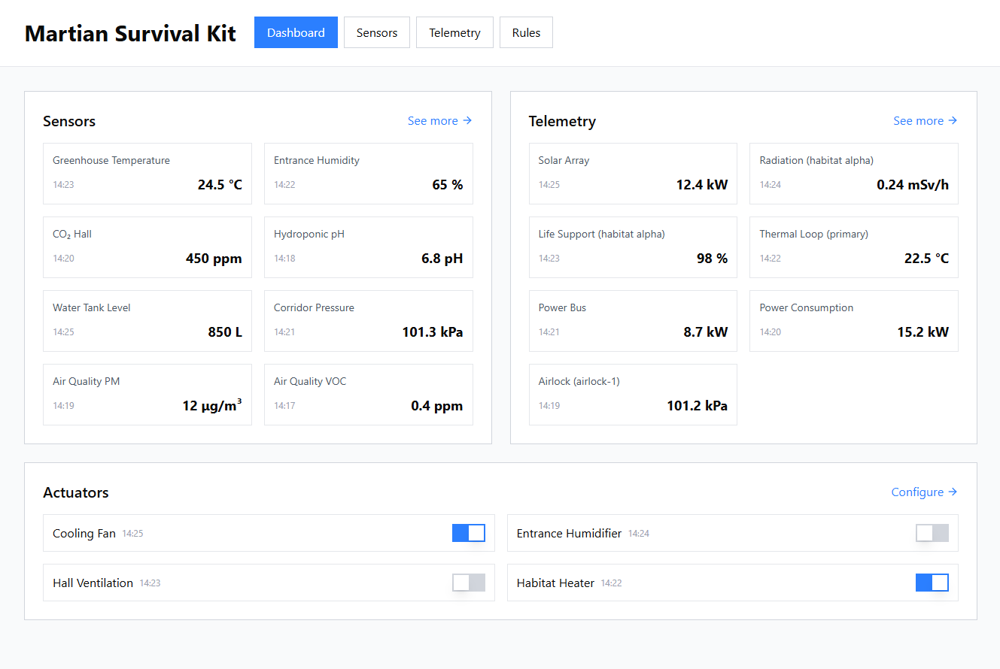
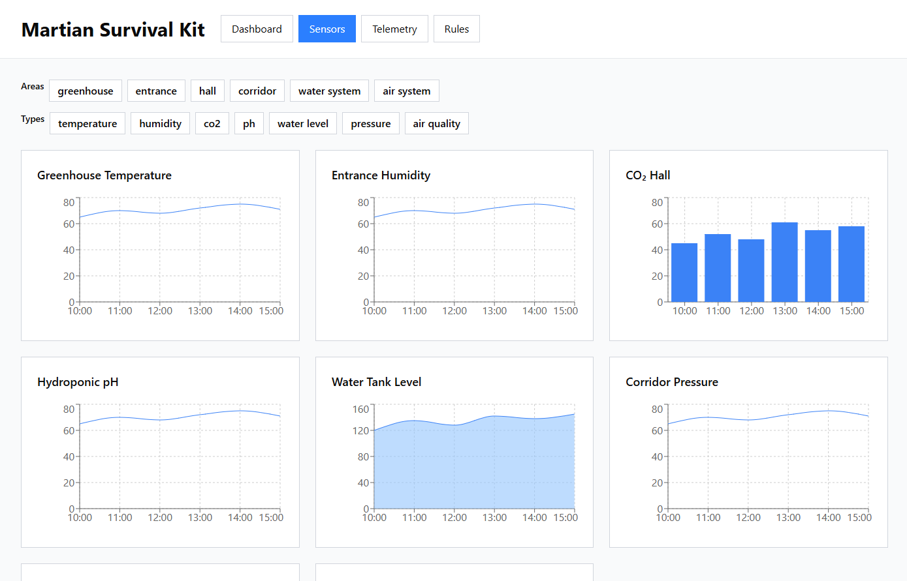
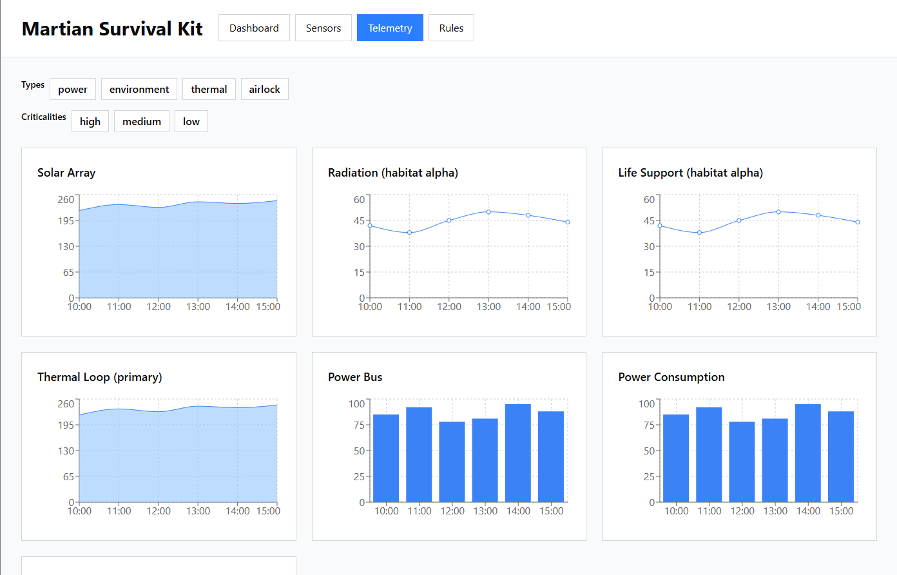
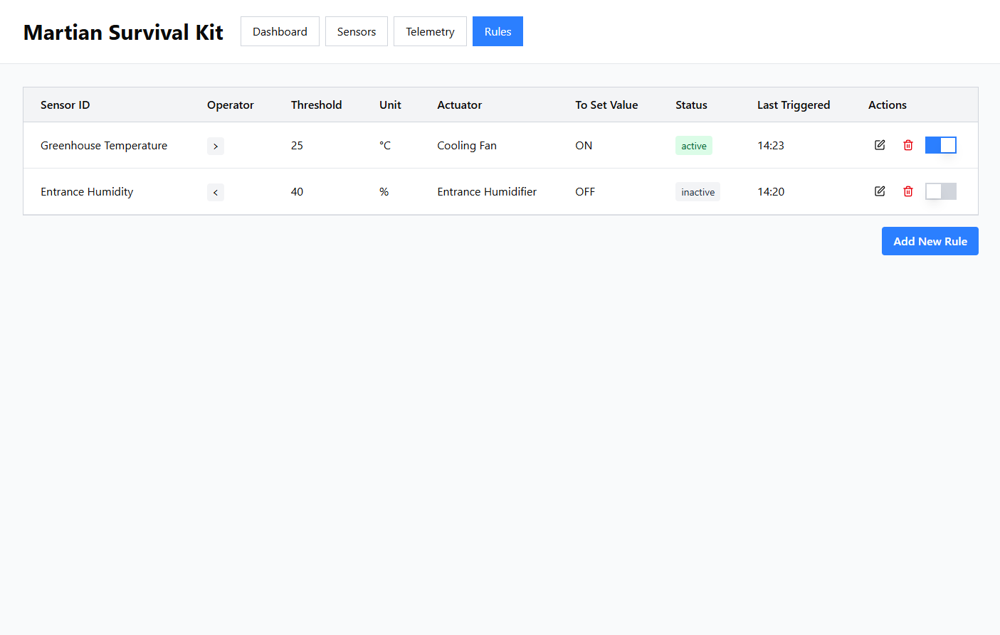
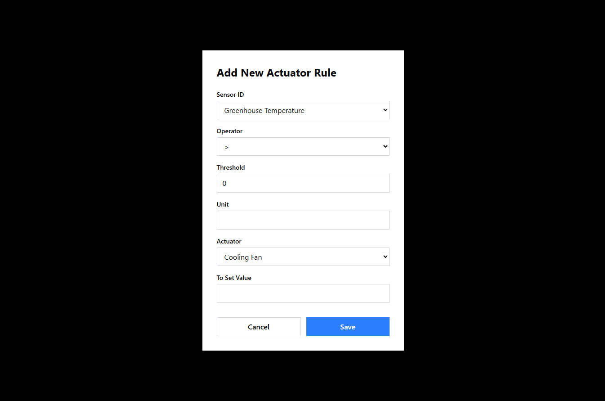

# APPLICATION OVERVIEW & NAVIGATION

This section presents the main pages of the Martian Survival Kit frontend and explains how to navigate through them.  
The four primary pages are represented by their respective mockups below.

---

## Dashboard
**Mockup:**  

**Description / Navigation Notes:**  

- Shows the **latest sensor values**, timestamps, warnings, and actuator states.
- Real-time updates via WebSocket.
- Users can quickly identify critical conditions.
- A header at the top displays the **application title** and **menu items**, which are **clickable for navigating** to the respective pages.
- Navigation is also possible via **buttons at the top-right of each card** (sensors, topics, actuators), which link directly to the **Sensors**, **Telemetry**, and **Rules** pages respectively.

---

## Sensors Page
**Mockup:**  

**Description / Navigation Notes:**  
Displays a **short-term history of sensor telemetry** using line, bar, and area charts.  
- Users can **switch metrics** or **measurement units** by clicking on the chart card.  
- Filters allow focusing on specific sensors or locations.  
- Data is updated in real time via WebSocket.

---

## Topics Page
**Mockup:**  

**Description / Navigation Notes:**  
Presents **internal telemetry topic data** with the same charts and interaction mechanisms as the Sensors Page.  
- Only the type of monitored entity differs.  
- Users can switch metrics and apply filters, charts update in real time.

---

## Rules Page
**Mockup:**

**Description / Navigation Notes:**  
Manages automation rules.  
- View all existing rules and their last triggered time.  
- Create, edit, delete, or temporarily disable rules using modal dialogs.  
- Interactions are handled via REST API; real-time rule triggers are updated via WebSocket.

---

# Rule Creation / Edit Modal

**Mockup:**  

**Description / Navigation Notes:**  
The modal allows users to **create or edit automation rules** with a guided form.

### Fields

| Field | Description |
|-------|-------------|
| Sensor / Topic ID | Enter the IDs of the sensors or topics monitored by this rule. |
| Operator | Select one of the operators (`=`, `>`, `<`, `>=`, `<=`) to define the condition. |
| Reference Value | Enter the value that will trigger the rule when the condition is satisfied. |
| Unit of Measurement | Choose the unit, especially for sensors with multiple metrics. |
| Target Actuator | Select which actuator the rule affects. |
| Actuator Value | Set the value or state to assign to the actuator upon triggering. |

### Behavior Notes  
- Real-time feedback is provided via WebSocket updates once rules are applied.  
- Supports both **creating new rules** and **editing existing ones** in a consistent interface.

---

# USER STORIES DOCUMENTATION

This document contains detailed explanations of each user story implemented in the frontend of the Martian Survival Kit.

---

## 1. Real-time Dashboard Updates
**User Story:**  
As a user, I want a dashboard that updates sensor values in real time, so that I can continuously monitor habitat conditions.

**Mockup:**  

**Description:**  
The Dashboard shows all sensors at a glance, displaying **only the most recent value**. Values are updated in real time via WebSocket.  
Widgets refresh automatically when new data arrives from the Presentation Service.

---

## 2. Last Sensor Update
**User Story:**  
As a user, I want to see when each sensor last reported data, so that I can detect devices that may be offline or malfunctioning.

**Mockup:**  

**Description:**  
Each widget displays the **timestamp of the last received value** for that sensor.  
This allows users to quickly identify offline or malfunctioning sensors.

---

## 3. Actuator Status Overview
**User Story:**  
As a user, I want to see the current state of each actuator, so that I know which systems are active.

**Mockup:**  

**Description:**  
Actuators are shown on the Dashboard with their current state (on/off).  
The initial state is retrieved from the Automation Engine API when the page loads.

---

## 4. Real-time Actuator Updates
**User Story:**  
As a user, I want the dashboard to update actuator states in real time when rules are triggered, so that I can see actions immediately.

**Mockup:**  

**Description:**  
When a rule is applied by the Automation Engine, the Presentation Service sends WebSocket events, and the Dashboard updates both actuator states and the last triggered timestamp.

---

## 5. Widget Filtering
**User Story:**  
As a user, I want to filter widgets by sensor type or location, so that I can focus on specific areas of the habitat.

**Mockup:**  

**Description:**  
Sensor widgets can be filtered by **area of interest** or **metric type**.
Filtering updates the view dynamically without reloading the page.

**Mockup:**  

**Description:**  
Telemetry widgets can be filtered by **topic type** or **criticality level**.
Filtering updates the view dynamically without reloading the page.

---

## 6. Auto-updating Charts
**User Story:**  
As a user, I want to see charts of sensor data that update automatically, so that I can track trends over time.

**Mockup:**  

**Description:**  
The **Sensors** and **Topics** pages display up to 500 of the most recent values stored temporarily in memory.  
Charts update automatically as new WebSocket events arrive.

---

## 7. Metric Selection
**User Story:**  
As a user, I want to choose which measurement to display for sensors that provide multiple types of data, so that I can focus on the information that is most useful to me.

**Mockup:**  

**Description:**  
Users on the Dashboard can click on the sensor or topic widget to view other available types of data. If multiple metrics are available, they will be displayed along with the relevant information.

**Mockup:**  

**Description:**  
Users on the Sensors Page can click on the sensor card containing the chart to switch to a different metric for that sensor.

**Mockup:**  

**Description:**  
Users on the Topics Page can click on the topic card to switch between available metrics for that topic.

---

## 8. Alerts
**User Story:**  
As a user, I want widgets to display alerts when sensor values exceed thresholds, so that I can respond immediately to critical conditions.

**Mockup:**  

**Description:**  
Widgets highlight **warnings** when values exceed configured thresholds.

When a new sensor value arrives with a warning status instead of the usual OK, the widget visually changes to indicate the warning: the widget border and background turn yellow, clearly signaling to the user that attention or intervention may be required.
Alerts are displayed immediately thanks to WebSocket updates.

---

## 9. View Automation Rules
**User Story:**  
As a user, I want to view all automation rules in a dashboard, so that I can understand which conditions trigger which actuators.

**Mockup:**  

**Description:**  
The Rules Page displays a table listing all configured automation rules. The table includes the following visible information: sensor id, operator, threshold, unit, target actuator, value to be set, rule status (active/inactive), last triggered timestamp, and a column for action buttons (edit, delete, switch status).

---

## 10. Create New Rules
**User Story:**  
As a user, I want to create new automation rules via the dashboard, so that I can add new behaviors without modifying code.

**Mockup:**  

**Description:**  
Users can open the creation modal by clicking the _Add new rule_ button present at the bottom of the page.
Users can create rules by specifying sensor id, operator, threshold, unit, target actuator, and value to be set.  

New rules are sent to the Automation Engine via REST API.

---

## 11. Edit Existing Rules
**User Story:**  
As a user, I want to edit existing automation rules, so that I can adjust thresholds, operators, or actuator targets.

**Mockup:**  

**Description:**  
Users can open the edit modal by clicking the _Edit_ button present in the row of the rule they wish to modify.
The modal has an identical structure to the creation modal, allowing users to adjust sensor id, operator, threshold, unit, target actuator, and value.

Updates are sent to the Automation Engine for immediate application.

---

## 12. Delete Rules
**User Story:**  
As a user, I want to delete outdated or unnecessary automation rules, so that only relevant rules are executed.

**Mockup:**  

**Description:**  
Users can delete obsole rules by clicking the _Delete_ button present in the row of the rule they wish to remove.

Updates are sent to the Automation Engine for immediate application.

---

## 13. Toggle Actuators
**User Story:**  
As a user, I want toggle widgets for actuators, so that I can turn devices on or off directly from the dashboard.

**Mockup:**  

**Description:**  
Users can manually toggle actuator states from the **Dashboard** by using the **switch** present in the widget of the corresponding actuator.  

Updates are sent to the Automation Engine for immediate application.

---

## 14. Temporarily Disable Rules
**User Story:**  
As a user, I want to modify existing automation rules so that I can temporarily disable them when needed.

**Mockup:**  

**Description:**  
Users can manually toggle actuator states by using the **switch** present in the row corresponding to the actuator.

Updates are sent to the Automation Engine for immediate application.

---

## 15. Last Triggered Time
**User Story:**  
As a user, I want to see the last time each automation rule was triggered, so that I can verify the automation engine is working correctly.

**Mockup:**  

**Description:**  
In the Rules Page table, each rule row includes a **Last Triggered** column.  

This value is updated whenever an actuator changes state due to the execution of a rule.  

Through WebSocket events, the system receives the actuator update together with the **state change timestamp** and the **rule that triggered the action**, allowing the corresponding row in the table to update the *Last Triggered* value in real time.